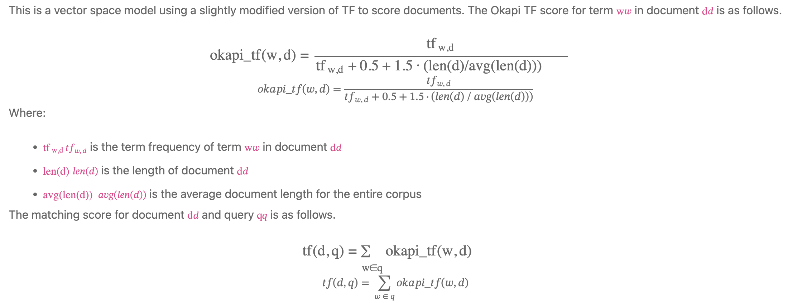
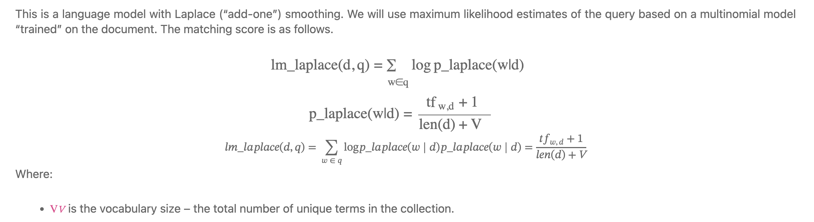
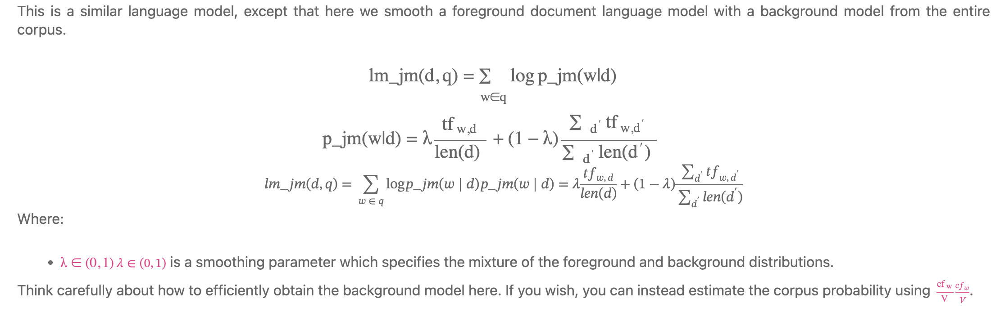

# homework-1-Evan-Chan-NEU

## This repo serves as a solution to the assignment detailed below.

- Task 1:  There were multiple issues running the docker compose file for elasticsearch and kibana (M1 Mac) so they were downloaded and run separately.

- Task 2:  The elasticsearch index for the ap89_collection corpus was created using the program found in the following file:
```
src/HW1_ParsertoIndex.ipynb
```

- Task 3:  The query processing for the retrieval models were executed using the following files (there is one file for each model so that they could be run simultaneously):
```
src/HW1_QP_M1.ipynb
```
```
src/HW1_QP_M2.ipynb
```
```
src/HW1_QP_M3.ipynb
```
```
src/HW1_QP_M4.ipynb
```
```
src/HW1_QP_M5.ipynb
```
```
src/HW1_QP_M6.ipynb
```

- Task 4:  The evaluation of retrieval model output scores (which are found in the results folder) is expressed in the report pdf file:
```
HW1Outputs/CS6200_HW1_Report.pdf
```

- Task 5:  The query processing for the psuedo-relevance feedback (of the Okapi TF model) was executed using the following file:

```
src/HW1_QP_RF.ipynb
```


## CS6200 Information Retrieval  Homework1: Retrieval Models

### Objective:

- Introduction to elasticsearch: one of the many available commercial-grade indexes.
Implement and compare various retrieval systems using vector space models and language models. Explain how and why their performance differs.

- This assignment involves writing two programs: A program to parse the corpus and index it with elasticsearch, A query processor to runs queries from an input file using a selected retrieval model

### Task1: Elasticsearch

- Download and install [elasticsearch](https://www.elastic.co/downloads/past-releases/elasticsearch-7-5-1), and the [kibana plugin](https://www.elastic.co/downloads/past-releases/kibana-7-5-1) (version 7.5.1 used here)

- Download IR_data/AP89_DATA.zip from Github (data included in repo)

### Task2: Document Indexing

- Create an index of the downloaded corpus. The documents are found within the ap89_collection folder. You will need to write a program to parse the documents and send them to your elasticsearch instance.

- The corpus files are in a standard format used by TREC. Each file contains multiple documents. The format is similar to XML, but standard XML and HTML parsers will not work correctly. Instead, read the file one line at a time with the following rules:
    - Each document begins with a line containing \<DOC> and ends with a line containing \</DOC>.
    - The first several lines of a document’s record contain various metadata. You should read the \<DOCNO> field and use it as the ID of the document.
    - The document contents are between lines containing \<TEXT> and \</TEXT>.
    - All other file contents can be ignored.

 - Use elasticsearch API to retrieve values like term frequency and term positions within a document. You will need such values to score documents using the retrieval models listed below.

### Task3: Query execution
- Write a program to run the queries in the file query_desc.51-100.short.txt. You should run all queries (omitting the leading number) using each of the retrieval models listed below, and output the top 1000 results for each query to an output file. If a particular query has fewer than 1000 documents with a nonzero matching score, then just list whichever documents have nonzero scores.

 - You should write precisely one output file per retrieval model. Each line of an output file should specify one retrieved document, in the following format:    \<query-number> Q0 \<docno> \<rank> \<score> Exp
	
    - \<query-number>	is the number preceding the query in the query list
    - \<docno>		is the document number, from the <DOCNO> field (which we asked you to index)
    - \<rank>		is the document rank: an integer from 1-1000
    - \<score>		is the retrieval model’s matching score for the document
    - Q0 and Exp 	are entered literally

- Your program will run queries against elasticsearch. Instead of using their built in query engine, we will be retrieving information such as TF and DF scores from elasticsearch and implementing our own document ranking. It will be helpful if you write a method which takes a term as a parameter and retrieves the postings for that term from elasticsearch. You can then easily reuse this method to implement the retrieval models.

- Implement the following retrieval models, using TF and DF scores from your elasticsearch index, as needed:
	
#### ES built-in

	
#### Okapi TF

	
#### TF-IDF


#### Okapi BM25


#### Unigram LM with Laplace smoothing


#### Unigram LM with Jelinek-Mercer smoothing


### Task4: Evaluation

- A) Compare manually the top 10 docs returned by ESBuilt-In, TFIDF, BM25, LMLaplace, for 5 queries specified by TAs. Explain or speculate on the reasons for differences in the rankings

- B) Download trec_eval and use it to evalute your results for each retrieval model:

	- To perform an evaluation, run:     trec_eval [-q] qrel_file results_file
	
	- The -q option shows a summary average evaluation across all queries, followed by individual evaluation results for each query; without the -q option, you will see only the summary average. The trec_eval program provides a wealth of statistics about how well the uploaded file did for those queries, including average precision, precision at various recall cut-offs, and so on.

	- You should evaluate using the QREL file named qrels.adhoc.51-100.AP89.txt, included in the data .zip file.

	- Create a document showing the following metrics:

		- The uninterpolated mean average precision numbers for all six retrieval models.
		- Precision at 10 and precision at 30 documents for all six retrieval models.
	
	- Be prepared to answer questions during your demo as to how model performance compares, why the best model outperformed the others, and so on.

### Task5: Pseudo-relevance Feedback (MS students only)

- Implement pseudo-relevance feedback. The general algorithm is:

	- Retrieve the top kk documents using one of the above retrieval models.
	- Identify terms in these documents which are distinctive to the documents.
	- Add the terms to the query, and re-run the retrieval process. Return the final results.

- It is up to you to devise a reasonable way to choose terms to add to the query. It doesn’t have to be complicated, but you should be prepared to explain and justify your approach.

- Evaluate your results using trec_eval and include similar metrics with your submission.
	
